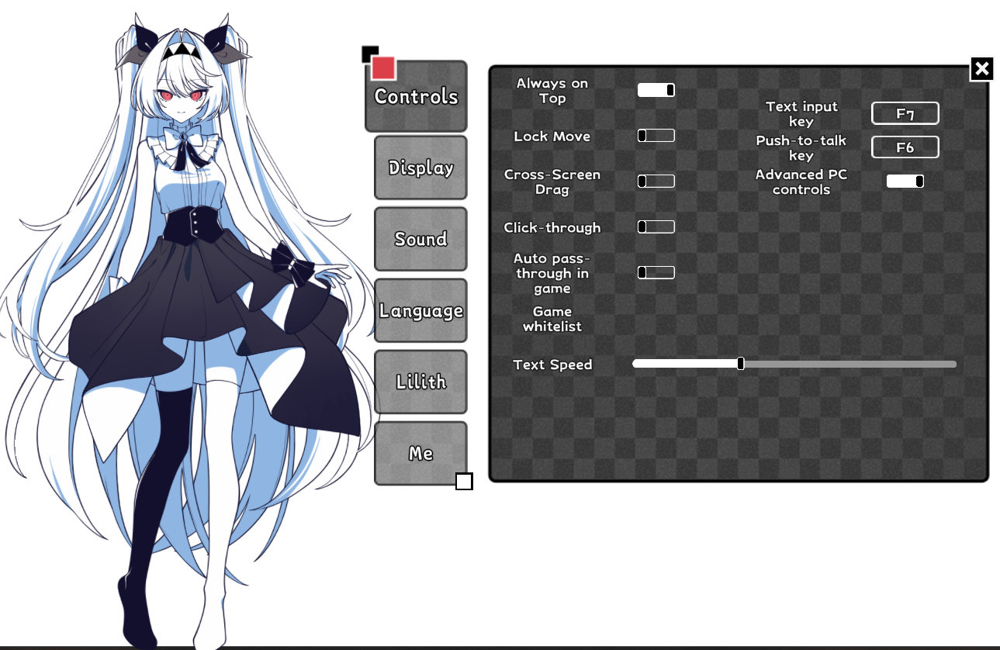
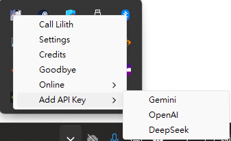

# ♡ Lilith AI MOD ♡

### 讓莉莉絲不只待在桌面，也能真正聽見你、記得你、回應你。
### Let Lilith hear you, remember you, and answer in her own voice.

🍓 **Unofficial Community MOD · 非官方社群 MOD** 🍓

[繁體中文說明](README_繁體中文.md) · [简体中文说明](README_简体中文.md) · [日本語ガイド](README_日本語.md) · [English Guide](README_EN.md)

---

## ✦ 歡迎回來 / Welcome back

這是一款為《The NOexistenceN of Lilith》桌寵製作的非官方 AI 擴充。它保留遊戲原本安靜、帶點哲學氣息的莉莉絲，並讓她能透過文字或麥克風與你自然聊天。

This unofficial AI extension for *The NOexistenceN of Lilith* keeps Lilith's quiet, philosophical charm while letting you talk to her naturally by text or microphone.

> 「今天也要和我說說話嗎？」  
> “Will you stay and talk with me today?”

## ♡ 她能陪你做什麼？ / What can she do?

| | 繁體中文 | English |
|---|---|---|
| 💬 | 使用文字或按鍵語音和莉莉絲聊天 | Chat through text or push-to-talk voice input |
| 🎙️ | 中文、日文語音輸出，並記住你的選擇 | Chinese and Japanese voice output with saved preferences |
| 🧠 | 保留有限的對話記憶與角色人格 | Keep lightweight conversation memory and character personality |
| 🌦️ | 查詢時間、天氣與網路資訊 | Check time, weather, and current web information |
| 💌 | 在重要對話後，偶爾收到她的信 | Receive occasional letters after meaningful conversations |
| 🖥️ | 經你開啟後，執行白名單內的電腦操作 | Run reviewed, allowlisted computer actions after you enable them |

設定、可自訂按鍵與中文／日文語音切換 · Settings, rebindable controls, and Chinese/Japanese voice selection

## ✦ AI 服務相容性 / AI provider compatibility

> **目前建議使用 Gemini。Gemini 是 0.1.0-RC1 唯一完成實際測試與針對性優化的服務；OpenAI 與 DeepSeek 僅提供實驗性的文字聊天相容層，尚未完成端到端測試。**

> **Gemini is currently recommended. It is the only provider tested and specifically optimized for 0.1.0-RC1. OpenAI and DeepSeek currently use an experimental text-chat compatibility layer and have not been tested end to end.**

| 功能 / Feature | Gemini | OpenAI / DeepSeek |
|---|---|---|
| 文字對話 / Text chat | ✅ 已測試並調整人格、上下文與多語言輸出 / Tested and tuned | 🧪 已實作基本相容，但未實測所有模型與回應格式 / Basic compatibility implemented; models and response formats not fully tested |
| `F6` 語音辨識 / `F6` speech recognition | ✅ 使用 Gemini 多模態音訊辨識 / Uses Gemini multimodal audio transcription | ⚠️ 目前仍需要另外設定 Gemini API Key；錄音不會送到 OpenAI 或 DeepSeek / A Gemini API key is still required; recordings are not sent to OpenAI or DeepSeek |
| 即時聯網搜尋 / Live web search | ✅ 使用 Gemini／Google Search grounding / Gemini with Google Search grounding | ❌ 尚未接入 / Not integrated |
| 自然語言電腦工具 / Natural-language PC tools | ✅ 支援 Gemini function calling、多步驟與結果回報 / Gemini function calling, multi-step actions, and result reporting | ⚠️ 只保留部分明確關鍵句的本機處理；未接入供應商工具呼叫 / Some explicit local commands remain; provider tool calling is not integrated |
| 日文顯示／語音分離與 AI 信件 / Split Japanese display/speech and AI letters | ✅ 以 Gemini 流程優化 / Optimized in the Gemini flow | 🧪 可能可用，但尚未驗證穩定性 / May work, but stability is unverified |

本機 GPT-SoVITS 語音合成可朗讀已成功取得的文字回覆，因此 OpenAI／DeepSeek 的文字聊天若正常回傳，仍可能播放合成語音；但這不代表該供應商的整體流程已完成測試。模型名稱、API 規格、地區限制或服務商更新也可能影響實驗性相容層。

Local GPT-SoVITS can speak a successfully returned text reply, so OpenAI/DeepSeek responses may still produce synthesized speech. This does not mean their complete workflows have been validated. Model names, API behavior, regional availability, or provider updates may also affect the experimental compatibility layer.

## 🍓 一鍵安裝 / One-click setup

### 下載方式 / Download options

- **[Google Drive 完整包鏡像 / Full package mirror](https://drive.google.com/file/d/1JYdSjJSuSd_VUxsOPWL1niAB6354c-QR/view?usp=sharing)**：下載 ZIP、完整解壓縮後執行資料夾內的 `LilithAI-Mod-Setup.exe`。  
  Download the ZIP, extract all files, and run `LilithAI-Mod-Setup.exe` from the extracted folder.
- **[GitHub Release](https://github.com/mimimi6666/Lilith-AI-Mod/releases/tag/v0.1.0-rc1)**：也可以從 Assets 下載 `LilithAI-Mod-Setup.exe`，並查看版本資訊與校驗檔。  
  You can also download `LilithAI-Mod-Setup.exe` from Assets and review the release notes and checksums.

1. 執行安裝程式；它會自動尋找 Steam 遊戲路徑。  
   Run the installer; it automatically searches your Steam libraries.
2. 開啟遊戲後，在左下角莉莉絲圖示按右鍵，選擇 AI 服務並輸入自己的 API Key。  
   Launch the game, right-click Lilith's tray icon, choose an AI provider, and enter your own API key.

從工作列選單加入自己的 API Key · Add your own API key and choose a provider from the tray menu

> ✧ 安裝包不包含作者的 API Key、聊天記錄、玩家名稱或私人資料。  
> ✧ The package contains no author API key, chat history, player name, or private data.

## ✦ 預設操作 / Default controls

- `F7`：開啟文字輸入氣泡 / Open the text input bubble
- 按住 `F6`：錄音；放開後辨識並送出 / Hold to record; release to transcribe and send
- 兩個按鍵皆可在遊戲設定中重新綁定 / Both keys can be reassigned in game settings

## 🖥️ 電腦操作 / PC controls

莉莉絲的電腦操作分成兩層。日常、低風險的功能可以直接使用；可能影響目前桌面狀態的功能，必須由玩家在遊戲設定中手動開啟「進階電腦操作」。這個開關**不會授予 Windows 系統管理員權限**。

Lilith's PC controls have two levels. Routine, low-risk actions are available normally. Actions that can affect the current desktop require the player to manually enable **Advanced Computer Controls** in the game settings. This switch **does not grant Windows administrator privileges**.

### ♡ 一般電腦操作 / Standard controls

不需要開啟進階功能：

Available without the advanced toggle:

- 依照常用名稱開啟或切回已安裝的應用程式與遊戲，例如記事本、計算機、瀏覽器、Steam、Spotify、Discord、VALORANT 等；不接受任意路徑或指令  
  Open or focus recognized applications and games by common name, such as Notepad, Calculator, a browser, Steam, Spotify, Discord, or VALORANT; arbitrary paths and commands are not accepted
- 播放／暫停、上一首、下一首、停止、靜音及調整系統音量  
  Play/pause, previous/next track, stop, mute, and system volume controls
- 查看非個人的本機狀態：電池、記憶體、系統磁碟可用空間與網路連線  
  Report non-personal local status: battery, memory, system-drive free space, and network availability

### ✦ 進階電腦操作 / Advanced controls

只有玩家主動開啟設定後才可使用：

Available only after the player explicitly enables the setting:

| 功能 / Feature | 可以做什麼 / What it can do |
|---|---|
| 📁 常用資料夾 / Known folders | 開啟下載、桌面、文件、圖片、音樂、影片、截圖、MOD 資料夾或資源回收筒；不接受任意檔案路徑 / Open Downloads, Desktop, Documents, Pictures, Music, Videos, Screenshots, the MOD folder, or Recycle Bin; arbitrary paths are not accepted |
| 🪟 視窗 / Windows | 顯示桌面、工作檢視、切換上一個視窗、最小化、最大化、還原，以及靠左／靠右排列 / Show Desktop, Task View, switch to the previous window, minimize, maximize, restore, or snap left/right |
| 📷 截圖 / Screenshots | 擷取所有螢幕並只存到 `圖片\Lilith Screenshots`；圖片不會回傳或上傳給模型 / Capture all monitors to `Pictures\Lilith Screenshots`; the image is not returned or uploaded to the model |
| 📋 複製文字 / Copy text | 只把玩家明確指定、非敏感的文字寫入剪貼簿；無法讀取剪貼簿 / Write only player-specified, non-sensitive text to the clipboard; clipboard reading is unavailable |
| 🔎 瀏覽器搜尋 / Browser search | 只有玩家明確要求時，才用預設瀏覽器開啟 Google 搜尋 / Open a Google search in the default browser only when explicitly requested |
| ⌨️ 安全快捷鍵 / Safe shortcuts | 復原、重做、儲存、全選、尋找、重新整理、全螢幕與 Escape；不支援任意按鍵或任意輸入 / Undo, redo, save, select all, find, refresh, fullscreen, and Escape; arbitrary keys and typing are unavailable |

